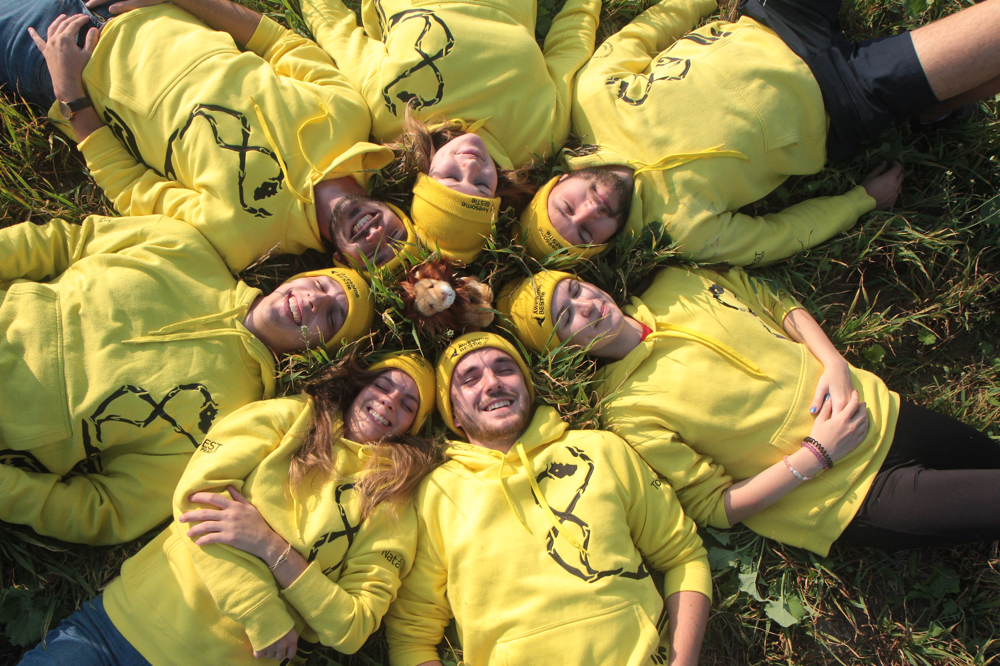
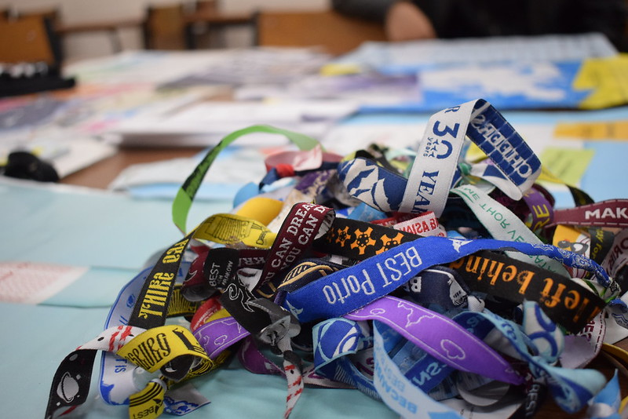

# La nostra identità

BEST aiuta gli studenti provenienti dalle università tecnologiche di tutta Europa e li spinge ad avere una mentalità più aperta e internazionale, al fine di ottenere una migliore comprensione delle diverse culture e la capacità di lavorare insieme, anche in un contesto così grande. Attraverso eventi – sia accademici che non – BEST offre agli studenti molte opportunità di incontrarsi e imparare gli uni dagli altri, condividendo le proprie conoscenze e idee. La nostra associazione offre anche servizi esclusivi come il centro internazionale per la carriera, che aiuta gli studenti quando entrano nel mondo del lavoro.

## La nostra Visione: potenziare la diversità

Le persone comprendono e rispettano culture e società diverse. L’ambiente di diversità potenziata supporta le persone nell’utilizzare tutto il loro potenziale e nell’agire in modo responsabile.

## La nostra Missione: sviluppare gli studenti

BEST aiuta gli studenti a raggiungere una mentalità internazionale, a raggiungere una migliore comprensione delle culture e delle società e a sviluppare la capacità di lavorare in ambienti culturalmente diversi. BEST crea opportunità per lo sviluppo personale degli studenti e li supporta nel raggiungere il loro pieno potenziale.

## Community

La nostra priorità è offrire servizi di alta qualità per gli studenti provenienti dall’Europa e costruire legami tra i tre stakeholder sempre più forti del triangolo: “Studenti, Aziende e Università”. Se vuoi saperne di più consulta il sito ufficiale www.best.eu.org.

