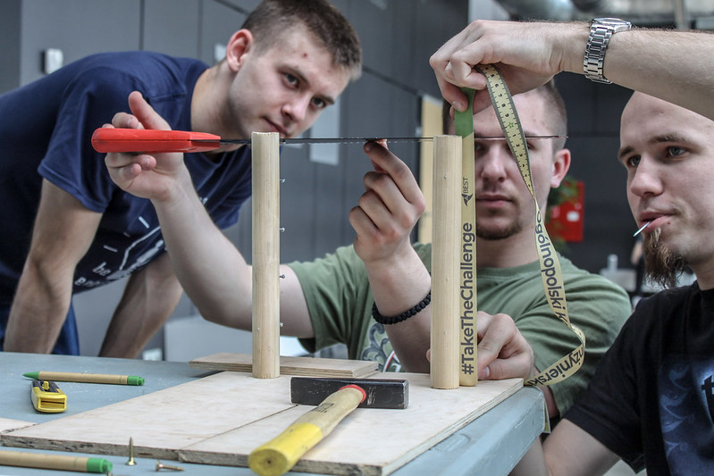
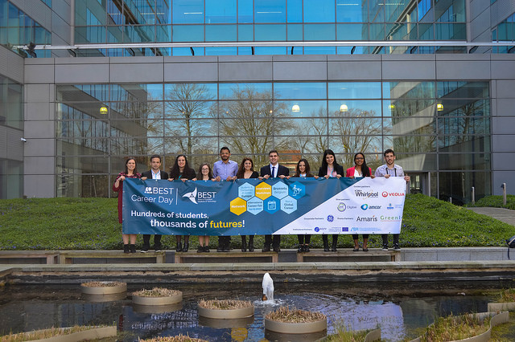

# Servizi

## BEST Course

- Completa le tue conoscenze in diversi campi di studio
- Visita ad aziende, stabilimenti industriali e centri di ricerca
- Partecipare a casi di studio
- Segui lezioni interessanti che coprono diversi campi della tecnologia, dell'economia, del marketing e del management
- Ricevi crediti ECTS in corsi riconosciuti

In questi eventi i partecipanti assistono a lezioni tenute da docenti universitari o da esperti delle aziende. Alla fine del corso, gli studenti sostengono un esame, progettato per valutare il successo dei partecipanti.

Un corso BEST è un evento ottimizzato e dovrebbe soddisfare questi criteri generali: fornire ai partecipanti nuove conoscenze o competenze, insegnate da professionisti. I corsi BEST sulla tecnologia, i corsi BEST sulle competenze professionali e i corsi BEST sull'ingegneria applicata sono sottotipi.

## Competizioni

Utilizza le conoscenze teoriche acquisite durante i tuoi studi sfidandoti a risolvere compiti interdisciplinari.

### Case Study

Il Case Study è una sfida teorica di problem-solving che richiede l'analisi, la ricerca, la deliberazione, il test e la presentazione di una soluzione che si adatti a uno scenario reale basato su risorse realistiche, entro un arco di tempo.

### Team Design

Il Team Design è un progetto pratico e pratico che richiede la progettazione, la creazione e la presentazione di un modello prototipo che soddisfi con successo specifici criteri di costruzione e funzionamento, entro un arco di tempo e attraverso l'uso di risorse limitate.

### Hackathon

L'hackathon è una "maratona" in cui programmatori di computer e altri sono coinvolti nello sviluppo di software o hardware.
L'obiettivo di un hackathon è creare software o hardware funzionanti da parte del
fine dell’evento, per risolvere al meglio un problema reale o un caso studio.

## Career Support

Attraverso BEST Career Support avrai uno stretto contatto con i nostri partner, potrai scoprire un nuovo ed entusiasmante futuro e iniziare una carriera internazionale.

Espandi i tuoi orizzonti di carriera incontrando aziende internazionali e mercati e sistemi di lavoro di altri paesi.
Acquisisci esperienza risolvendo compiti reali e avvicinati alla realtà del settore.
Costruisci la tua rete internazionale ed entra in contatto con aziende e università alla ricerca dei migliori talenti.
Ricevi offerte di lavoro, stage e laureati e arricchisci il tuo CV.
