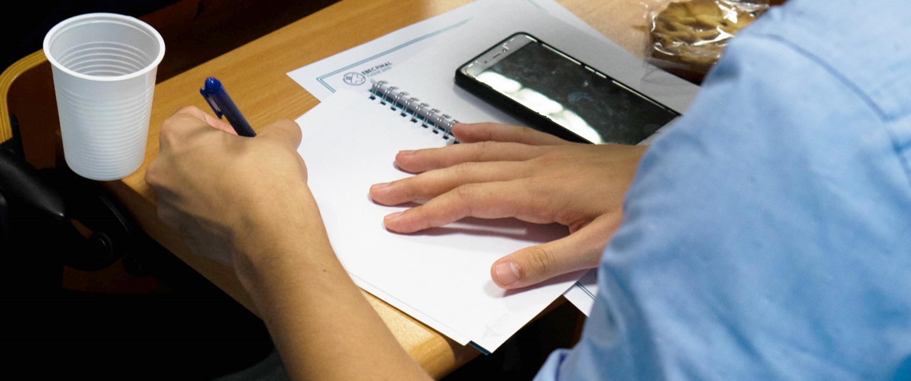

# Guida: come scrivere una Motivation Letter

Scrivere la Motivation Letter è un passaggio importante nella procedura di invio della domanda per i corsi, è la base su cui il gruppo organizzatore sceglierà i partecipanti!

Da dove iniziare, quindi? Cosa si dovrebbe dire? Cosa non si dovrebbe dire?

Non esiste una ricetta sicura al 100% per essere selezionati... L'unica certezza è che provarci non costa nulla! Tuttavia, ci sono dei consigli che dovresti seguire per aumentare le tue possibilità.

Queste linee guida sono pensate per aiutarti a scrivere la tua Motivation Letter. Tuttavia, tieni presente che non esistono modelli perfetti o istruzioni infallibili, quindi questi sono solo consigli generali e rappresentano soprattutto un punto di partenza per aiutarti a scrivere una buona Motivation Letter, aumentando le tue possibilità di essere accettato! Da dove cominciare?

- Prima di candidarti a un evento, ti consigliamo di leggere con molta attenzione le informazioni sulla pagina web. Come sarà l’evento? Che tipo di partecipanti cercano gli organizzatori? ecc... Leggere la Survival Guide può essere molto utile a tal proposito!
- Ogni gruppo locale BEST può ricevere qualcosa come quattrocento lettere per il loro corso! Riesci a immaginare di leggere tutte quelle Motivation Letter diverse? Se vuoi che la tua lettera si distingua, allora prova a essere creativo e divertente, e a catturare l’attenzione di chi la leggerà.
- La lettera deve essere scritta in inglese.
  Puoi trovare informazioni sui vari eventi sulla pagina https://www.best.eu.org/courses/list.jsp

## Cosa scrivere

- Prenditi il tempo per scriverla con impegno e fantasia! Perché vuoi partecipare a un evento BEST? E perché proprio a quell’evento?! Potrai anche visualizzarla e ritoccarla dopo averla inviata. Non stai facendo domanda per il CNR, ricorda sempre che chi leggerà e giudicherà la lettera saranno ragazzi come te, o forse anche più giovani: spiega quindi i tuoi interessi professionali, ma dedica almeno altrettanto spazio a parlare di te e dei tuoi hobby… Non scrivere una poesia, ma nemmeno due righe… una pagina andrà bene. Un altro consiglio è fare riferimento all’argomento del corso, in cui sei molto interessato (all’estero guardano molto il tuo interesse non solo “goliardico” ma anche “accademico”) 🙂
- Presentati. Inizia scrivendo qualcosa su di te: cosa studi, cosa fai nella vita, quali sono i tuoi hobby, quali sport pratichi, magari anche quali lingue conosci… I corsi BEST sono sempre pieni di divertimento, quindi è utile per gli organizzatori sapere che sei una persona simpatica e socievole.
- Interesse per il corso. Perché vuoi andare all'estero? E perché vuoi andare a quell’evento BEST? Ricorda, è importante per gli organizzatori avere persone con una mentalità internazionale. Perché vuoi partecipare a questo particolare corso per cui ti candidi? Perché l’argomento ti attrae? Come ti aiuteranno le conoscenze di quel corso (nel tuo percorso di studi, nella tua futura carriera…)? I corsi BEST, per esempio, hanno una forte componente accademica (a seconda del livello del corso), quindi è importante per gli organizzatori sapere se sei davvero interessato all’argomento! Ricorda che non stai facendo domanda per il CNR; chi leggerà e giudicherà la lettera saranno ragazzi come te, o forse anche più giovani.
- Interesse per la città in cui si tiene il corso. Spiega perché vuoi andare in quella città o paese! È fortemente consigliato fare una piccola ricerca sul luogo in cui si terrà il corso e per cui ti stai candidando prima di scrivere le tue Motivation Letter. Cerca monumenti famosi, cibo e bevande tipici, tradizioni, ecc... Agli organizzatori piace quando i candidati mostrano un vero interesse per la loro città.
- Cosa hai più degli altri. Cosa hai da offrire all’evento? In altre parole, perché gli organizzatori dovrebbero prendere te? (ad es: sei una star del karaoke, balli come Michael Jackson, o conosci più di 100 barzellette ecc...).

## Cosa evitare

- La tua Motivation Letter sarà letta da studenti, proprio come te. Pertanto, non è necessario usare forme formali come “Egregio Signore o Signora”!
- Una Motivation Letter NON è un curriculum vitae (CV). Non perdere tempo a scrivere tutte le scuole che hai frequentato, i voti, i lavori che hai svolto… Vogliono sapere qualcosa su di te e su come sei!
  Non è consentito inserire immagini o link nella tua Motivation Letter.
- Stai attento a inviare la lettera giusta al posto giusto.
- Copiare/incollare una Motivation Letter non è altamente raccomandato. Dovresti cercare di rendere ogni lettera personale e unica!
- Non scrivere una poesia, ma neanche due righe! Mezza pagina (o una pagina) di foglio A4 è già sufficiente, e dovrebbe bastare agli organizzatori per conoscerti. Se la lettera è più lunga di una pagina e mezzo/due di A4, c’è la possibilità che non leggano tutto. D’altra parte, se è troppo breve, penseranno che non sei abbastanza interessato all'evento! Quindi cerca di trovare il giusto equilibrio.
- Evita di inviare le domande all’ultimo minuto, per evitare il crash del sito (man mano che si avvicina la scadenza, i server potrebbero essere sovraccaricati a causa dell’elevato flusso di domande).

## Altri consigli

- Dividi la tua Motivation Letter in paragrafi: sii chiaro, ma soprattutto cerca di non essere banale, e mettici il cuore!
- Dati personali: nel tuo account BEST c’è una sezione chiamata “Dati Personali”: i tuoi studi, hobby, conoscenze linguistiche… Cerca di compilarla il più possibile!
- Fattore tempo: prima invii la candidatura, prima gli organizzatori possono iniziare a leggerla. Quindi non ridurti all'ultimo momento per farlo.
- Inviaci le tue Motivation Letters per avere consigli o per correggere eventuali errori in inglese. Saremo felici di aiutarti, ma fallo per tempo, evitando di ridurti all'ultimo, perché tanti altri ragazzi come te lo faranno e potremmo essere sovraccarichi di lavoro. Puoi inviarle a messina@BEST-eu.org.
