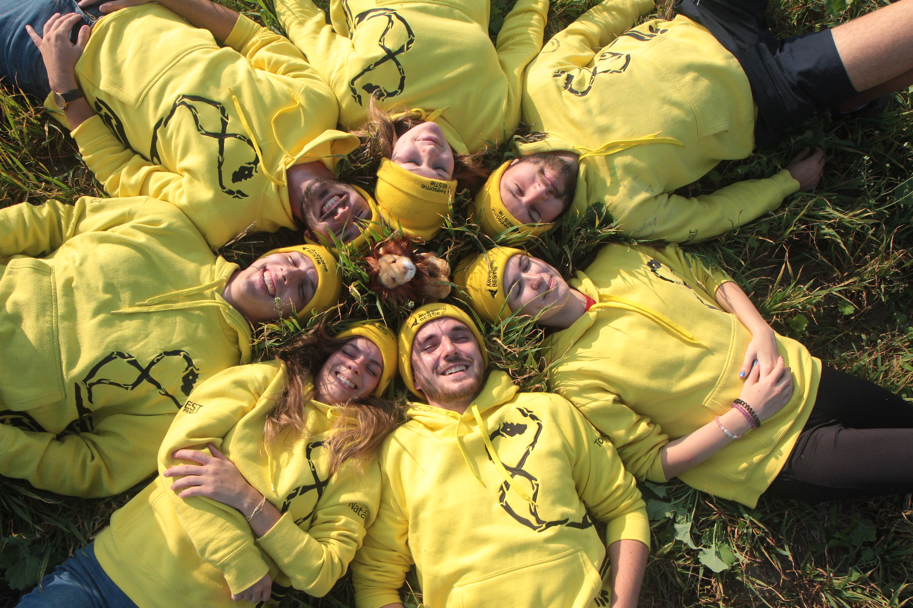
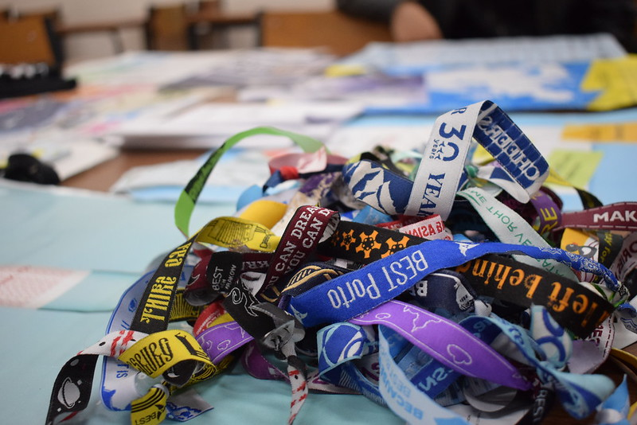

# About us

BEST helps students coming from universities of technology all over Europe and push them to be more open-minded and international, in order to get a better understanding of different cultures and the ability of working together, even in such a big contest. Through events – both academical and not – BEST makes plenty of opportunities for students to meet and learn from each other, sharing their knowledge and ideas. Our association also offers exclusive services such as the international center for career, that helps students when they enter the job world.

## Our Vision: Empowered diversity

People understand and respect different cultures and societies. The environment of empowered diversity supports people in applying their full potential and acting responsibly.

## Our Mission: Developing students

BEST helps students to achieve an international mindset, to reach a better understanding of cultures and societies and to develop the capacity to work in culturally diverse environments.
BEST creates opportunities for personal development of students and supports them in reaching their full potential.

## Community

Our priority is to offer high quality services for students from Europe and to build links between the three stakeholders of the triangle always stronger: “Students, Companies and Universities”. If you’d like to discover more, check the official website www.best.eu.org .

