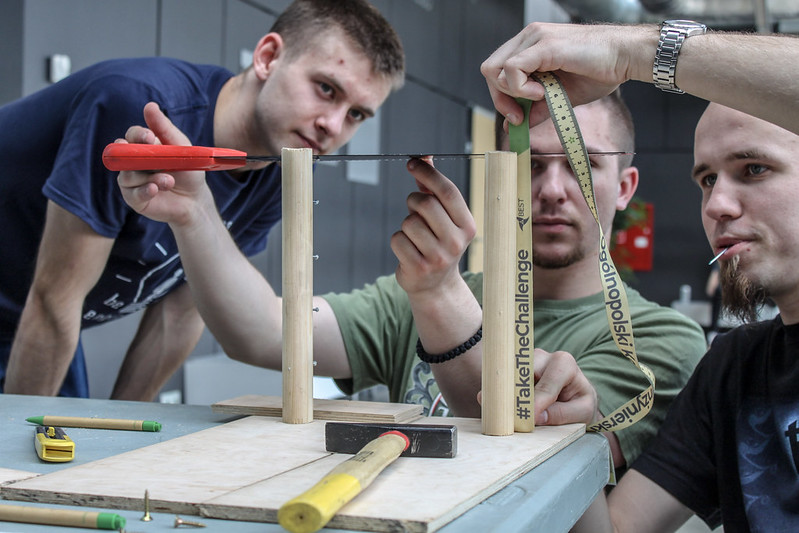

# BEST Courses

Complement your knowledge in different fields of study
Visiting companies, industrial plants and research centers
Participate in case studies
Take interesting lessons covering different fields of technology, economics, marketing and management
Receive ECTS credits in recognized courses
In these events, participants attend lectures given by university lecturers or by experts from companies. At the end of the course, students take an exam, which is designed to assess the success of the participants.

A BEST course is an optimized event and should meet these general criteria: provide participants with new knowledge or skills, taught by professionals. The BEST courses on technology, BEST courses on career skills and BEST courses on applied engineering are subtypes.

# Competitions

Use the theoretical knowledge gained during your studies by being challenged to solve interdisciplinary tasks.

### Case Study

The Case Study is a theoretical problem-solving challenge that requires analysing, researching, deliberating, testing and presenting a solution that fits a real-case scenario based on realistic resources, within a time-frame.

### Team Design

The Team Design is a practical hands-on project that requires designing, creating and presenting a prototype model that successfully meets specific construction and operation criteria, within a time-frame and through the use of limited resources.

### Hackathon

The hackathon is a "marathon" in which computer programmers and others are involved in software or hardware development.
The goal of a hackathon is to create functioning software or hardware by the
end of the event, in order to solve a real problem or a case study in the best way possible.

# Career Support

Through BEST Career Support you will have a close contact with our partners, you will be able to discover a new and exciting future and start an international career.

Expand your career horizons by meeting international companies and other countries working market and systems.
Gain experience by solving real tasks and get closer to the industry’s reality.
Build your international network and get in touch with companies and universities looking for top talent.
Get job offers, internships and graduate and enrich your CV.
