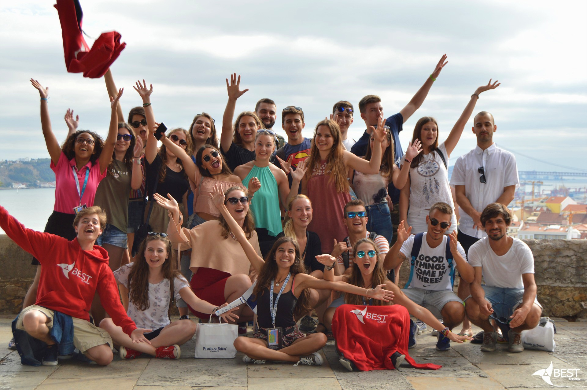

# BEST Courses

Each year, the various local BEST groups scattered throughout Europe organize a course, lasting about a week. These courses can take place in 4 fundamental periods of the year, at the discretion of the organizing group, and in full compliance with the BEST rules: Autumn, Winter, Spring, Summer. Here’s what these courses offer you:

- Visit to companies, industrial plants and research centers;
- Possibility to take part in the Case Study;
- Take classes in English that cover many different technological fields: IT, robotics, chemistry, biology, economics, marketing and management etc.;
- Receive European ECTS credits, so these courses will be recognized in your academic career and will be worth training credits.

To see all the courses, check out this page: [BEST Courses](https://www.best.eu.org/courses/list.jsp).

Remember: you will only pay for the trip; not food, lodging and all the rest !!! It is a unique opportunity to get to know Europe and increase your cultural background as well as improve your curriculum!

## How do I go to these courses?

### 1. Requirements

You must be a student enrolled at the University of Messina, attending a course of scientific-technological studies (Engineering, Sciences, …)

### 2. Register a BEST account

Go to the registration page on https://www.best.eu.org/account/registration.jsp and click on “I accept the terms of registration as given above”. After entering your name, surname, email address, gender, date of birth and citizenship, send the registration. You will receive a confirmation email from BEST IT Support with the password (which you can change when you want) to access the account.

The second step is to log into the site and continue the identification procedure, otherwise your account will not be valid yet. Therefore click on “Activating your account for Courses” and proceed by filling in the required fields. In the University field, if you are a student of the Messina university, choose: “Italy – University of Messina”, otherwise your registration will go elsewhere and we will not be able to help you (and you will not be able to leave).

Note: in the “Student Identifier” field enter your student ID (matricola).

### 3. Validate your account

Once you have completed your registration on the site, you just have to send an email to the local group BEST Messina messina@BEST-eu.org in which to attach

A certification of enrolment to the University of Messina. You can find it on Esse3 in

- `Registrar’s Office > Registrations > Print registration application` OR
- `Registrar’s Office > Certificates > Autocertificazione Anni iscrizione`

A repeipt of the last payment to the University of Messina, it is needed to certify your student status. You can find it on Esse3 in

- `Registrar’s Office > Payments > Tassa di immatricolazione (numero fattura) > Stampa quietanza di pagamento` OR
- `Registrar’s Office > Certificates > Autodichiarazione Tasse per anno solare – year 20XX`

This way your account will be validated, and you will be able to send your applications for the courses.

### 4. Apply to the events you are interested in

BEST courses are the heart of BEST events and are divided into categories: on Technology, on Career Related Skills, on Applied Engineering. In each season (Winter, Spring, Summer, Autumn) you can apply to participate in 6 events, including no more than 3 BEST Courses.

The selection is made by the students of the organizing group on the basis of a question, consisting of three main fields. The first concerns any courses you have taken that have some relationship with the topic of the event you are applying for (but it is not essential). The second is the real heart of the question: the Motivation Letter, for which we recommend that you check out our guide ([click here](../the_motivation_letter/index.md) to read it). With this letter you will have to convince the organizers that you are the right person for their event! No media on exams therefore, only your ability to put pen to paper the desire you have to discover Europe! Find the space to fill it out by following the instructions in your BAS account. The third field consists of three questions to answer, some of which are related to the course you want to follow, and which are important to test your motivations! Try to be original!

### 5. Wait for the selection and confirm

About two weeks after the deadline for applications, the list of students chosen to participate in the events will be made public: each one can be chosen for a course and for an unlimited number of other events. If you no longer intend to leave, don’t worry: let us know and nothing will happen, you can always apply for future events. If, on the other hand, you are more and more convinced to immerse yourself in a BEST adventure and confirm your participation, you will have to pay us a deposit of 50 euros, which we will give you back after you return from this fantastic experience.

### 6. Cross your fingers

There is no 100% safe recipe to be selected … The only certainty is that trying doesn’t hurt! However, there are tips you should follow to increase your odds. For this reason, we suggest you read our guide on how to write a Motivation Letter.

## Further information

Don’t miss this opportunity !!! You will be able to discover Europe, learn and have fun. For any other problem or doubt, do not hesitate to contact us by email at messina@BEST-eu.org, and / or on our Facebook page BEST Messina. You will find students like you, who will be available to give you a hand and all the necessary clarifications.
